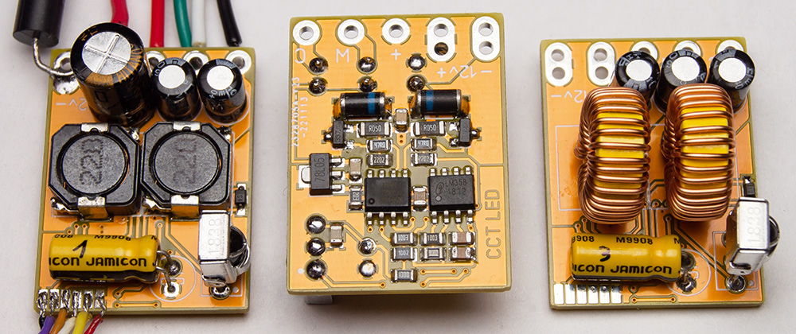
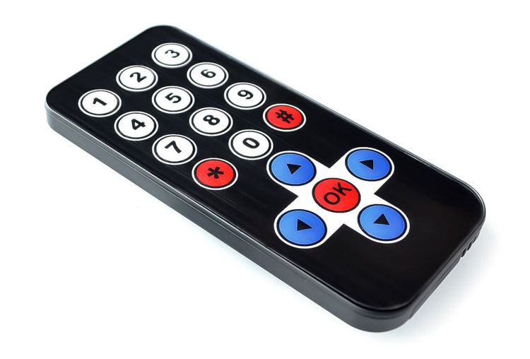
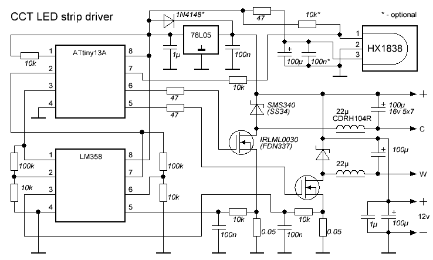
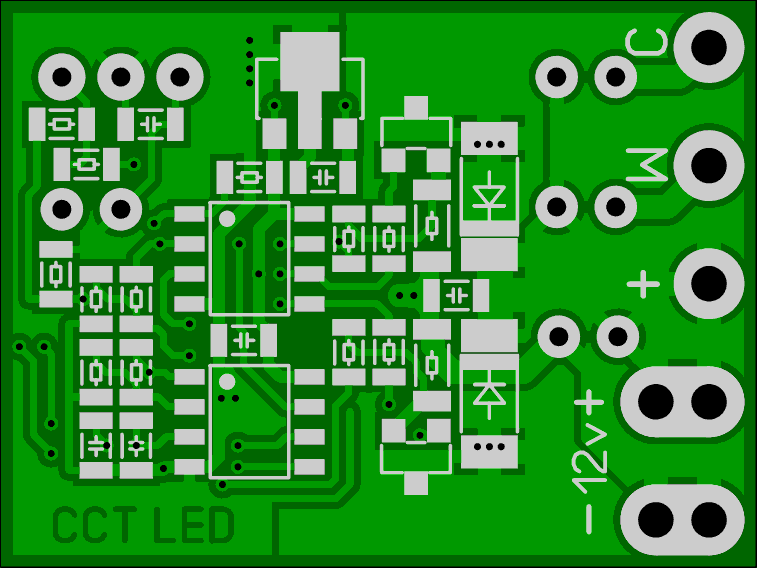
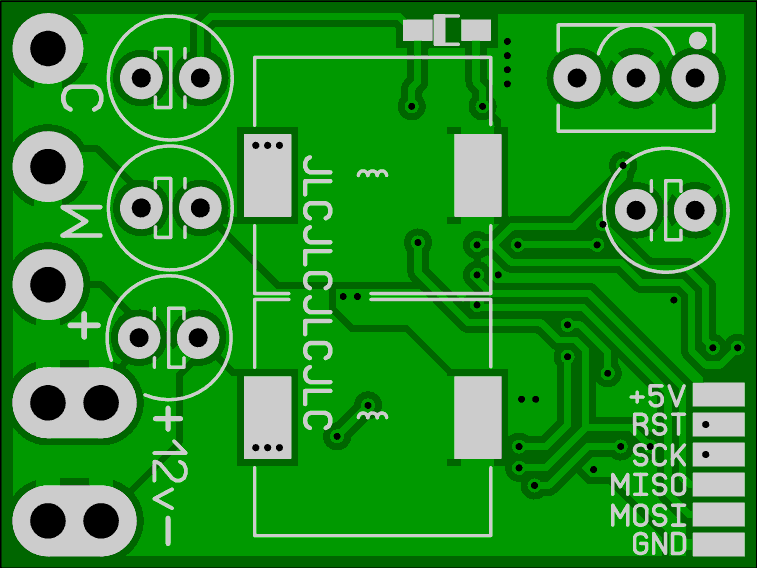

# CCTLed
A simple CCT Led strip driver with IR remote



## Features and capabilities:
- High PWM frequency, low ripple, low EMI, **no flicker**
- Full range of brightness and temperature control
- Settings are retained in EEPROM
- 12 presets (4 levels of brightness * 3 values of temperature)
- Soft turn-on and turn-off
- Has constant supply current regulation (ultimately the brightness depends on the input voltage)
- Can handle up to ~50W of total maximum output power for 12V led strip (2A per channel)

Higher input voltage can be used, up to 24V, assuming the appropriate input capacitor voltage and proper power consumption calibration.

The driver is supposed to be used with this kind of generic 21-key IR remote:


Any other NEC protocol remote can be used, appropriate keycodes must be assigned in the firmware.

## Firmware upload
It is recommended to use [Arduino IDE](https://www.arduino.cc/en/software) with an external programmer. [MicroCore](https://github.com/MCUdude/MicroCore) is required. Add a custom clock configuration to 'boards.txt' and select it:
```
13.menu.clock.9M60=9.6 MHz internal osc. 0ms start delay
13.menu.clock.9M60.bootloader.low_fuses=0b0{bootloader.eesave_bit}110010
13.menu.clock.9M60.build.f_cpu=9600000L
```
Otherwise, the driver will blink every time it is turned on. Alternatively, you could solder a 10k resistor in parallel to each mosfet gate to prevent it from opening while the MCU pins are in Hi-z state.

Each driver **needs to be manually calibrated** because it uses the ADC's internal 1.1V reference, which is stable but not at all accurate initially. Calibration values can be loaded from EEPROM (although this is disabled by default).

## Circuit diagram


Gerber files are provided:

 
